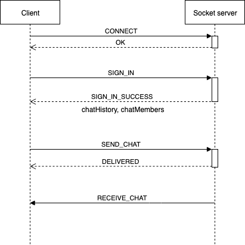

## Document

### Build and run

Build this project by follow these steps below:

1. `git clone https://github.com/kai-lma/react-chat-client`
2. `cd react-chat-client`
3. `yarn install`
4. `cp .env.example .env`
5. `yarn build`
6. `yarn global add serve`
7. `serve -s build`

Make sure you have `node` and `yarn` on your machine.

### Why Web Socket

#### UX first

As we are creating a chat app, it wouldn't be a good idea to ask user constantly reload browser to get new messages.
Instead, we will create a realtime chat app using web socket.

Web socket fits for our requirements and provides better user experiences.

#### Scaling

With web socket, our app would be easier to scaling both server and client side,
flexible to changes and easily adding more functions (such as adding typing status, read user, delete message in realtime...)

### Why Redux Observable and RxJS

#### Declarative coding style

Redux Observable is a Redux middleware library empowered by strength of RxJS.
Providing ways to compose and cancel async actions to create side effects with declarative code (Functional Reactive Programming style) for more readable and easier to maintain.

#### Fit for socket

RxJS webSocket [_interface_](https://rxjs-dev.firebaseapp.com/api/webSocket/webSocket) is easy to work with.
Expressly it's really great when writing mock stubs for performance debugging.

#### Easy for testing

By using Redux Observable we can dependency-injecting our socket stream for not only communication with socket server but also extremely useful when writing test.

As RxJS webSocket is a `Subject` so we can inject a mock `Subject` to stub every events from server without using extra mocking library like Sinon.

Also testing asynchronous event with [_RxJS marble diagram_](https://github.com/ReactiveX/rxjs/blob/master/docs_app/content/guide/testing/marble-testing.md) may leverage testing quality.

#### Robustness

RxJS built-in operators give super power to composing redux actions declaratively.

Operators like `debounce`, `throttle`, `buffer` or `retry`... can be used right out of the box.

#### Trade off: Steep learning curve

Paradigms like Functional Programming, Functional Reactive Programming and Redux Observable patterns sometimes overwhelm beginner and requires some time to master it.
But the benefits are profound.

### Socket Server and Mocking

#### Chat server functionalities

Current chat server provides these abilities:

1. Create user with a name
2. Log user in with a name
3. Get list of users in the chatroom
4. Get history messages from the chatroom
5. Receive message sent by the user
6. Broadcast received message to other users in the chatroom

To reduce many round trips and network traffic, I would ask the back-end guys to send back the history messages and the list of joining member when user successful logged in.

#### Socket event flows

<p align="center">



</p>

### Other notes

#### Why not static type check (Flow / Typescript)

Adding static type check to React project is believed to be a good practice for type safety and facilitate development process.
However, the reasons why I'm not using static type to current project is listed below:

- Current project is relatively small. Adding static type check won't speed up development process very much.
- Requiring type checking places like socket event object is runtime type-check, TypeScript and friends won't shine much here.

When the project grows in size, it might be useful to introduce static type check to our code base.

Personally, I would pick Flow over TypeScript for faster transpiling speed.
Another good option is ReasonML but it hasn't been widely adopted yet.

#### Small UX improvement: Experimental message sent status

After sending a message to server, server will send back a signal to tell that the message has been delivered.

With delivered signal we can update current message (eg: `isDelivered: true`) and trigger updating DOM.
But this may trigger re-render whole messages list which cause performance dropped.

Instead, to keep re-renders and DOM updates as small as possible, we will track delivered message id in `deliveredMessageIds` array.
Separate a `DeliverStatusIndicator` component that watch for if current message id is included in `deliveredMessageIds`.

When delivered signal is received, React will only updates the `DeliverStatusIndicator` component without re-render whole messages list.

## Think Ahead

### Security

#### Using `wss` protocol

We should use the secure `wss://` protocol over the insecure `ws://` transport.
Like HTTPS, WSS (WebSockets over SSL/TLS) is encrypted, thus protecting against man-in-the-middle attacks.

#### Authenticate before connect to socket server

Basically the WebSocket protocol doesn’t handle authorization or authentication.
This means our current chat app doesn't have any authentication mechanism in it.

For more secured, we should authenticate users before the web socket connection establishes.
We could follow [_the ticket pattern_](http://lucumr.pocoo.org/2012/9/24/websockets-101/) to achieve this.

### Quality

#### Using buffer to save the redux reducer and render UI

When client side receiving messages too fast may cause pressure to redux reducer and DOM updating.

To slow down the incoming event stream, we can use lossless back-pressure method like buffer to improve our app performance.

The idea is instead of dispatch each socket event to the reducer, we will use an array to buffer some events then dispatch this array to reducer itself to slow down the updates and re-renders.

Fortunately, RxJS are very good of dealing with this kind of situation.

For example, we can buffer event every 500ms with single line of RxJS operator `bufferTime` like this:

```diff
const receive$ = socket$ =>
  socket$.pipe(
++    bufferTime(500),
    map(parseSocketEventsToAction),
  );
```

### Failure tolerant

#### Retry when disconnected

Current chat app will inform user if the socket was disconnected by simply toasting the message directly to the user.

It would be nicer if our app has ability to re-connect and tell the user that you can continue to chat.

Again thanks to RxJS this can be achievable by using operators like `retry` or `retryWhen`.
